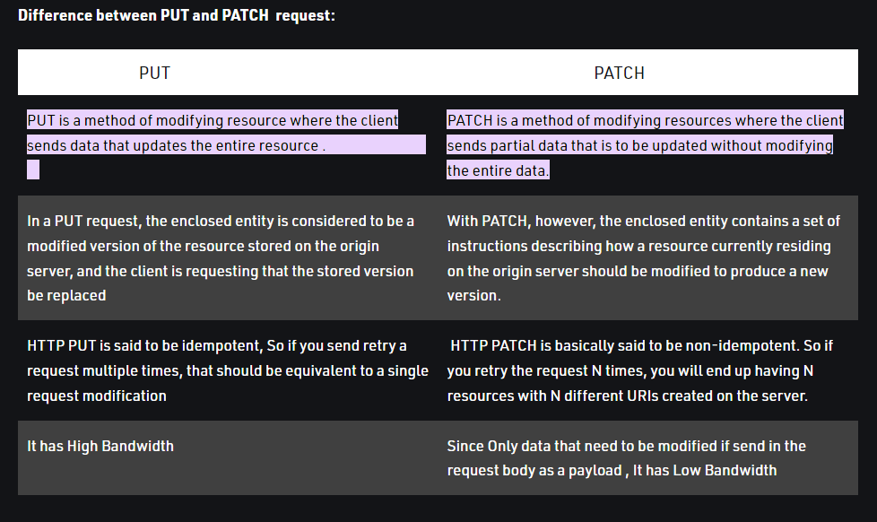

# Lab 404

#### Did you use the same type of route to update patient information and to update an employee department?  

No, I used a @PutMapping route to update patient information giving all the patient info changing only
the info I wanted to change. But in the case of updating the employee department I used @PatchMapping
 route to only update what I needed to change. (I have to say that in the first case I use json
object in the body to change the info, in the employee case I used a raw txt with the string to update the info).

#### Why did you choose the strategy that you chose?

Because in the first case I needed to be able to change the information in any variable of the 
patient but in the employee case I updated only one variable at a time.

#### What are the pros and cons of the strategies you chose for creating these routes?

I think the big difference is the quantity of variables I needed to put in the body in order to
update the information. In the patient case I have to update all variables even if I wanted to change only
one. But in the second case I choose a different route for update a single variable.

#### What are the tradeoffs between PUT and PATCH?

Basically I understand the differences explained in the picture above.